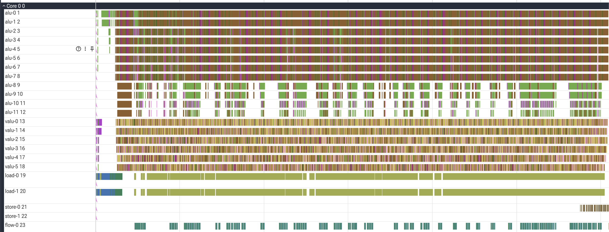
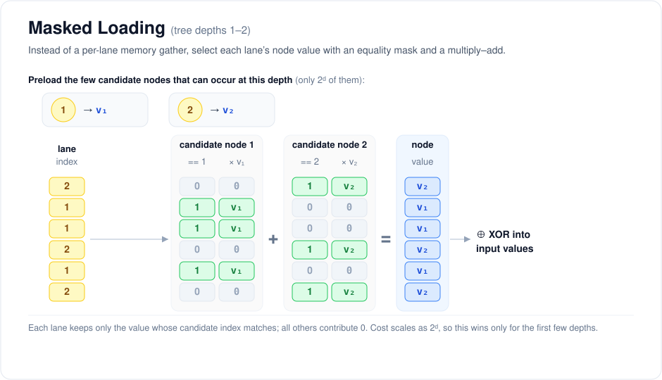
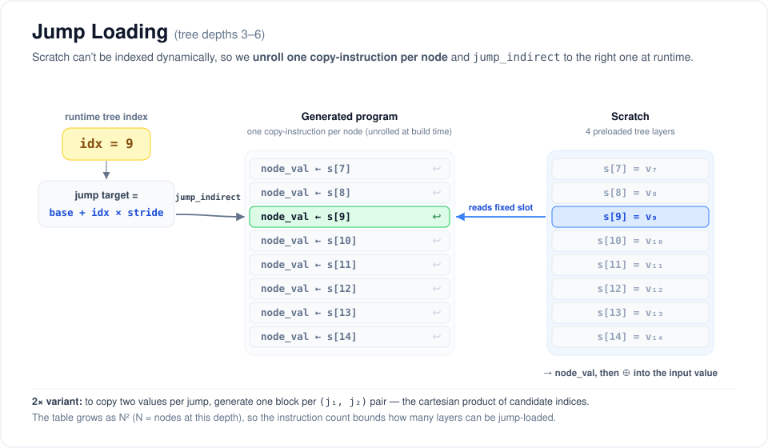

# My Solution: Anthropic's Original Performance Take-Home

My solution scores 1221 cycles on the test case.

For more details on my solution, see the writeup below.

```
(anthropic_performance_takehome) robertgordan@Roberts-MacBook-Air ~/P/anthropic_performance_takehome (main)> python tests/submission_tests.py
Testing forest_height=10, rounds=16, batch_size=256
CYCLES:  1221
Testing forest_height=10, rounds=16, batch_size=256
CYCLES:  1221
Testing forest_height=10, rounds=16, batch_size=256
CYCLES:  1221
Testing forest_height=10, rounds=16, batch_size=256
CYCLES:  1221
Testing forest_height=10, rounds=16, batch_size=256
CYCLES:  1221
Testing forest_height=10, rounds=16, batch_size=256
CYCLES:  1221
Testing forest_height=10, rounds=16, batch_size=256
CYCLES:  1221
Testing forest_height=10, rounds=16, batch_size=256
CYCLES:  1221
.Testing forest_height=10, rounds=16, batch_size=256
CYCLES:  1221
Speedup over baseline:  120.994266994267
........
----------------------------------------------------------------------
Ran 9 tests in 0.590s

OK
```



<br><br>

# Solution:

Much of my work on the challenge went into optimizing my solution against two major bottlenecks. The first of these bottlenecks is data loading, and the second is the arithmetic operations involved in hashing.

## Data Loading

Because input values are contiguous, they can be loaded relatively cheaply using vload ops (8x per op, 2x per cycle). We also have enough scratch space to keep the entire batch of 256 loaded across rounds, and only write the results to memory when finished.

The node values are more challenging, because we need to access arbitrary indices as we progress through the tree traversal, depending on the results of the hashing. The load op only gives us 2 values per cycle. For 16 rounds and a batch size of 256, this gives us a floor of (16 x 256) / 2 = 2,048 cycles. Clearly, Claude was able to do better than this! 

My solution has a few improvements on the naive loading approach:

### Depth 0: the deterministic case

For the 16 round setting, each input value will be at depth 0 in the tree twice. In these rounds, we know that the node value will always be the root node for every input. This means we can preload the root node, keep it in scratch, and apply it deterministically whenever we’re at depth 0.

### Depth 1-2: masked loading

Although depths beyond 0 won’t be deterministic, we still know that there are very few possible options. Instead of loading each node value separately, we can again preload them. To match the right node value against the right input at runtime, we can maintain a set of constant vectors corresponding to the associated indices. Then, we can loop over each potential node value and check if the input’s index matches the node’s index. If they do, the result of the '==' operation will be 1, and we can use this result to accumulate the node value into the result vector, since for all other indices the incremental accumulation will be 0. Unfortunately, the number of operations needed for this approach scales exponentially with the depth of the tree, so it’s only helpful for a couple layers. I did some rough back of the envelope calculations by setting the number of cycles needed as a function of tree depth equal to each other, and came up with 3.64, which seems to line up with the empirical evidence that 3 is the optimal setting.



### Depths 3-6: jump loading

Ideally we could load all or part of the tree into scratch, as we did with the input values, and access them using cheaper arithmetic operations. The challenge is that there is no available operation that can reference scratch space dynamically (ie, based on the value of another scratch entry), as we need to do for node values. The only operation that I could see which has this behavior in any form is the jump_indirect operation, which jumps to a location in the program specified by a scratch entry. My solution leverages this by loading 4 layers of the tree into scratch and implements a codepath that generates alu instructions to copy data from all possible indices. At runtime, the machine jumps to the correct instruction. I extended this to load 2 values at a time by generating instructions for the cartesian product of possible indices within the tree. In theory, this could be extended as far as the underlying data structure of the program allows, but the number of instructions generated explodes quickly.



## Arithmetic Operations

### Multiply Add Hashing Trick

For the hashing stages of the form: f(x) = (x << a) + x + b

We can fold the entire formula into a single multiply_add operation of the form: x * (2 ^ a + 1) + b, instead of the three operation naive case.

For stage 3, we can do two multiply_add’s in the previous stage, since both left bit shift or addition operations can be folded in for free, and then xor the result, which saves 1 operation.

Unfortunately, I found no optimizations for the xor-based stages. I tried to fold the final constant xor of the hash into the subsequent node value application for preloaded node values, but this necessitated an extra index update operation.

### Index Update Special Cases

For the final round, and any round at depth 0, we don’t need to update the index at all, since we aren’t checking it to load the node value. For depth 1, we can skip multiplying the previous index by 2, since the previous index was 0.

### Index Update General Case

I ended up with a 3-operation index update flow. I found a mild savings from storing the indices directly as their memory locations, rather than 0-indexed. The third operation of the index update is a constant factor correction, but the load operation can use these indices directly.

## Scheduling, Interleaving, and Simulation

Regardless of these optimizations, there are a handful of paths that we can take when generating the final program. First, we can choose to prioritize processing a single vector of the input until done (“depth-first”), or prioritize processing every vector in each round before progressing to the next one (“breadth-first”). I found that by far the best scheduling strategy was to take the depth-first approach for the first 14 rounds, before waiting to process each vector breadth-first in the final 2 rounds.

I also added some infrastructure to facilitate the packing of operations into the earliest available instruction, including a wrapper object class to track when scratch data could next be accessed. One optimization enabled by the wrapper class is that we can write in the same cycle as the last read, while reads need to wait one cycle to access data from the previous write.

Finally, I implemented a simple simulation mechanism through the helper function interleave_engine_fns, which returns the earliest cycle at which a given set of instructions would complete. My solution uses this simulation to greedily decide whether to load node values from memory or via jump loading, when both are possible. This provides a 53 operation speedup vs routing only a fixed fraction of loads to the jump loading path. In other instances, the greedy simulation proved less helpful, as the faster instruction bundle at a given point in the kernel building process may consume more of the bottlenecked resource when all other instructions are ultimately included.

One additional helper function wraps interleave_engine_fns and leverages the simulation path to decide whether to generate valu or equivalent alu operations for a given vector operation. Because the basic design of the solution is oriented around vectorized calculation, alu capacity was often available. This provides a significant (200 cycle) speedup.

The logical extension of these simulation and dependency management techniques would be to track the full dependency graph, and implement a full compiler that optimizes the speed of the program end-to-end. Unfortunately, this seems like quite a hard problem!
